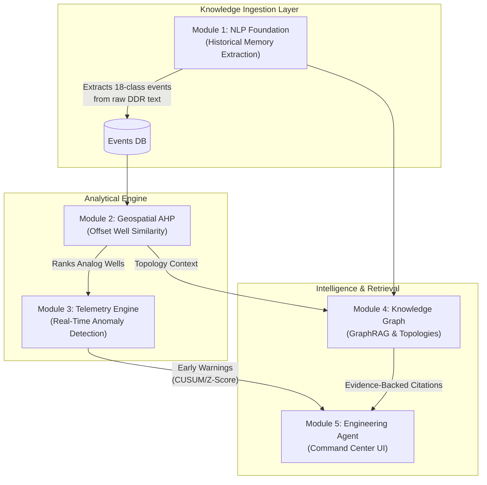

<div align="center">


# 🌊 PRAVAH (eRTMAC-NWIS)

**An AI-native, multi-modal intelligence platform for predictive drilling hazard prevention.**

[](#)
[](#)
[](#)
[](#)
[](#)

[Overview](#-executive-summary) • 
[Architecture](#-system-architecture) • 
[Capabilities](#-core-capabilities) • 
[Data & Backtesting](#-ground-truth-validation) • 
[Quickstart](#-quickstart-guide)

</div>

---

## ⚡ Executive Summary

In modern oil and gas operations, **Non-Productive Time (NPT)** accounts for up to 25% of total well costs, translating to tens of millions of dollars in losses per well. While high-frequency live telemetry (eRTMAC) provides visibility at the drill bit, it lacks the context of historical institutional memory. 

**PRAVAH** bridges this critical gap. Designed with the rigor expected in enterprise-grade, safety-critical systems, PRAVAH is an AI Copilot that ingests live rig sensor streams and cross-references them against decades of unstructured Daily Drilling Reports (DDRs). By employing Dual-Algorithm Anomaly Detection (CUSUM & Z-Score) and multi-dimensional Geospatial AHP Similarity, PRAVAH predicts hazards like stuck pipe and mud loss **hours before they escalate into catastrophic failures.**

> *PRAVAH doesn't just show you what is happening; it computes what it means, mathematically quantifies the risk, and retrieves the exact historical precedent to tell you how to stop it.*

---

## 🏛 System Architecture

PRAVAH operates on a scalable, asynchronous microservice architecture comprising 5 distinct intelligence layers.



---

## 🚀 Core Capabilities

### 1️⃣ Automated Historical Knowledge Extraction
Decades of engineering experience are locked in unstructured text files. PRAVAH utilizes advanced NLP pipelines to parse thousands of Daily Drilling Reports (DDRs), automatically extracting a highly structured database of drilling events, interventions, and outcomes.

### 2️⃣ Multi-Dimensional Offset Well Similarity (AHP)
Geographic proximity alone is insufficient for predicting hazards. PRAVAH applies Saaty’s **Analytic Hierarchy Process (AHP)** to calculate similarity based on:
- 📍 Geographic Proximity
- 📐 Trajectory & Inclination Profiling (via FastDTW)
- ⚙️ BHA Mechanical Configurations
- 🪨 Formation Stratigraphy Match

### 3️⃣ Dual-Algorithm Real-Time Anomaly Detection
Threshold-based alerts generate fatigue. PRAVAH uses a dual-topology approach on live WITSML telemetry:
- **Rolling Z-Score (Transient):** Detects sudden spikes, kicks, and instantaneous stalls.
- **Recursive CUSUM (Persistent):** Detects slow, creeping friction (Tight Hole/Drag) over hundreds of meters that humans easily miss.
- **Smith-Waterman Alignment:** Aligns the live failure sequence against the historical offset sequence to compute a Wilson Score Confidence Interval.

### 4️⃣ 3D Knowledge Graph & GraphRAG Retrieval
A flat database cannot answer relational engineering questions. PRAVAH represents the entire basin history as a beautiful, interactive 3D Knowledge Graph. When queried, our proprietary **GraphRAG** pipeline traverses structural geology nodes, retrieving mathematically verified, cited evidence for every claim.

### 5️⃣ AI Engineering Copilot
The central command dashboard offers an interactive AI agent. Engineers can chat with PRAVAH in natural language (e.g., *"What interventions were successful for mud loss in the Barail formation?"*) and receive precise, cited, and actionable guidance without ever leaving the telemetry view.

---

## 🔬 Ground-Truth Validation (The Backtest)

To ensure PRAVAH operates flawlessly in production, the system was subjected to a causality-preserving time-travel backtest using real-world data from the **Equinor Volve Field** (North Sea) and **FORCE 2020** datasets.

| Metric | PRAVAH Performance (Well 15/9-F-9A) |
|--------|------------------------------------|
| **Hazard Analyzed** | Stuck Pipe Incident @ 619.0 m |
| **First Precursor Warning** | 302.2 m MD *(316m before failure)* |
| **Actionable Alert Lead Time** | **+106.48 meters** |
| **Time Gained for Intervention** | **~44 Minutes** at standard ROP |
| **Data Leakage** | Zero (Strict causality preserved) |

*By providing an engineer with a 44-minute lead time before a drill string becomes irreparably stuck, PRAVAH single-handedly prevents multi-million dollar fishing operations and sidetracks.*

---

## 🛠 Tech Stack

Designed for resilience, concurrency, and high throughput:

- **Backend:** `Python 3.10+`, `FastAPI`, `Uvicorn`
- **Data Science & Math:** `Pandas`, `NumPy`, `FastDTW`
- **Search & Graph:** `ChromaDB` (Vector Store), `NetworkX`
- **Frontend & UI:** `HTML5/CSS3 Grid`, Vanilla JS, Custom High-Tech Glassmorphism Design System
- **LLM Integrations:** `HuggingFace`, Local Evidence Synthesis, Gemini/Qwen via API

---

## 💻 Quickstart Guide

Getting PRAVAH running on your local machine takes less than 60 seconds.

### 1. Clone & Prepare
```bash
git clone https://github.com/Yug210705/Project-Pravah.git
cd Project-Pravah
```

### 2. Launch the Unified Environment
We have provided an automated PowerShell orchestrator that handles virtual environments, dependencies, and concurrent microservice bootstrapping.

```powershell
# Windows
.\start_all.ps1
```

*(For Linux/macOS users, simply run `bash start.sh`)*

### 3. Enter the Command Center
Once the gateway confirms all modules are `UP`, open your browser:
👉 **[http://localhost:5000](http://localhost:5000)**

---

## 📖 Directory Structure

```text
Project-Pravah/
├── NLP/
│   └── nlp_task_ddr/
│       ├── gateway.py            # Unified API Routing
│       ├── module1/              # DDR NLP Extraction
│       ├── module2/              # AHP Geospatial Engine
│       ├── module3/              # Live Telemetry Simulator
│       ├── module4/              # GraphRAG & 3D Knowledge Graph
│       └── module5/              # AI Engineering Agent
├── datasets/                     # Historical DDRs & WITSML CSVs
├── patch_theme_hightech.py       # Centralized UI Styling Engine
├── start_all.ps1                 # Bootstrapper
└── README.md                     # You are here
```

---

<div align="center">
  
**Developed for the Smart India Hackathon 2026**<br>
*Problem Statement: SIH26121 (Oil India Limited)*

[](#)

</div>
